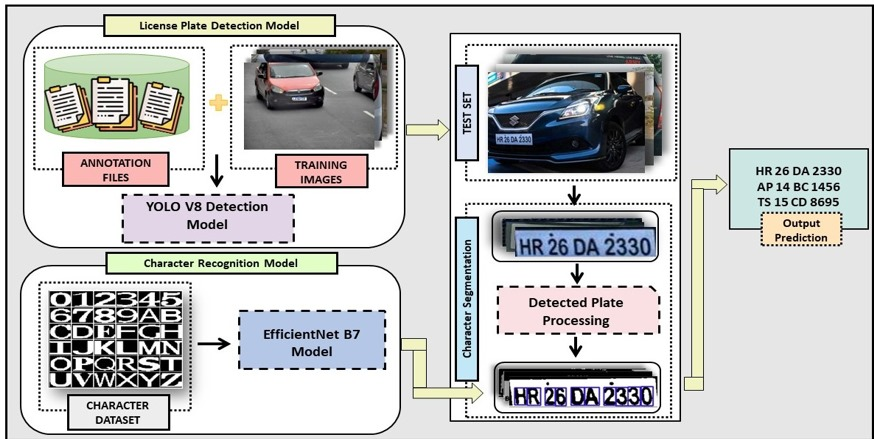
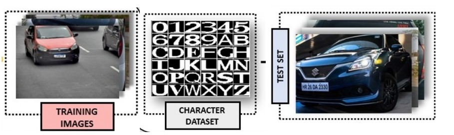
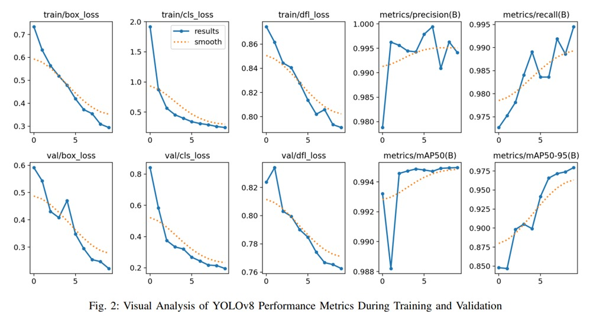
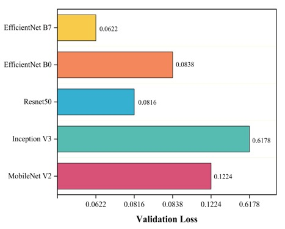
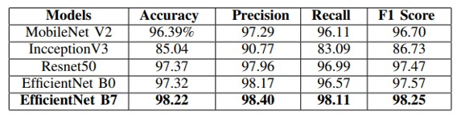
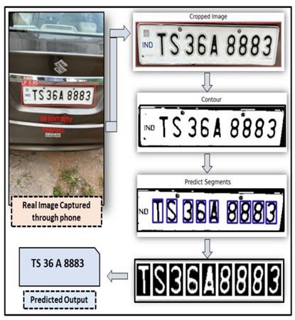
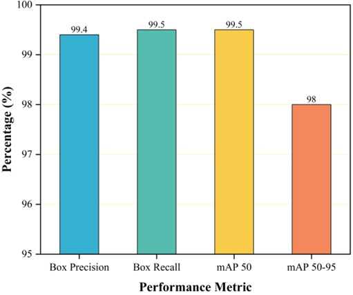

# Automatic License Plate Identification Using YOLOv8 and EfficientNet B7

## Overview

This repository contains the implementation of an Automatic License Plate Recognition System (ALPRS) leveraging the capabilities of YOLOv8 for license plate detection and EfficientNet B7 for character recognition. This project aims to enhance the accuracy and efficiency of license plate recognition systems, particularly in real-world scenarios.   

## Authors
- **Rohan Reddy B**
- **Gunti Swathi**

Presented at the **4th International Conference on Computing Communication and Intelligent Systems (ICCCIS-2023)**, 3-4 November 2023.

## Problem Statement
Manual vehicle identification via license plates is time-consuming and requires advanced Automatic License Plate Recognition (ALPR) systems for accurate and swift identification, impacting traffic control and safety. Existing ALPR methods often struggle with issues like lighting variations and complex backgrounds, necessitating the use of advanced deep learning models.

## Proposed Solution

This research proposes a two-stage ALPR system that employs:
- **YOLOv8** for license plate detection.
- **EfficientNet B7** for character recognition.

### Key Improvements of YOLOv8
- Anchor-free detection
- Unique backbone network
- Pioneering loss function
- Space-efficient spatial pyramid pooling layer

### EfficientNet B7 for Character Recognition
EfficientNet B7 is a highly accurate, compact, and fast pre-trained CNN model trained on the Imagenet dataset, excelling in image recognition tasks.

## Methodology

### License Plate Detection
YOLOv8 processes an image and its annotation file, outputting bounding boxes, class labels, and confidence scores. It is designed for two classes: license plate and background. The detection involves:
- Grid-based detection
- High-level feature extraction
- Non-maximum suppression
- Post-processing for result refinement

### Character Recognition
EfficientNet B7, after extensive evaluation, emerged as the top performer for license plate character recognition among pretrained CNN models with 98.22% accuracy. Its exceptional performance led to its selection as the optimal choice for character recognition in the ALPR system.

## Datasets Utilized

1. **Artificial Mercosur License Plates Dataset**:
   - 3840 images of license plates from five South American countries.

2. **Open-source Character Recognition Dataset**:
   - 37623 images encoding digits and letters numerically from 0 to 35, ensuring balanced character distribution.

3. **Novel Testing Dataset**:
   - 500 images, each accompanied by its respective plate number for evaluation purposes.

## Results and Discussion

### License Plate Detection Results
- **YOLOv8** achieved high accuracy in license plate detection, outperforming traditional methods significantly.

### Character Recognition Results
- **EfficientNet B7** demonstrated a superior performance with a character recognition accuracy of 98.22%, making it the optimal choice for our ALPR system.

## Conclusion

The proposed ALPR system, combining YOLOv8 for license plate detection and EfficientNet B7 for character recognition, significantly enhances the accuracy and efficiency of automatic license plate identification. This system addresses the challenges faced by existing ALPR methods and provides a robust solution for real-world applications.

## Testing on a Sample Camera captured Image

## Overall Result on Custom test set

## Future Work

Future research could focus on:
- Enhancing the system's robustness to various environmental conditions.
- Expanding the dataset to include more diverse license plate formats.
- Integrating real-time processing capabilities for on-the-fly license plate recognition.

## Acknowledgements

We would like to thank the organizers of the **4th International Conference on Computing Communication and Intelligent Systems (ICCCIS-2023)** for providing the platform to present our research.

---

Feel free to contribute, raise issues, or provide feedback on this project. Let's work together to enhance the capabilities of ALPR systems!

---

**Contact**
- For any queries or collaborations, please contact [Rohan Reddy B](mailto:rohanbadugula9@gmail.com).

---

**License**
- This project is licensed under the MIT License - see the [LICENSE](LICENSE) file for details.
